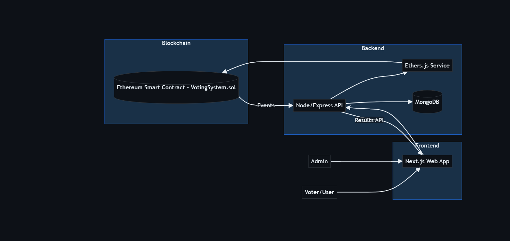
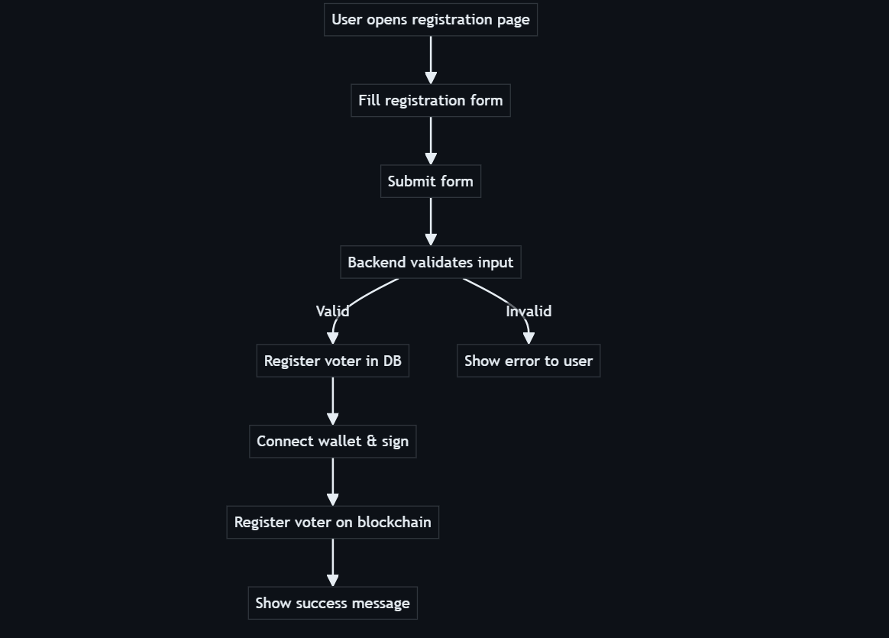
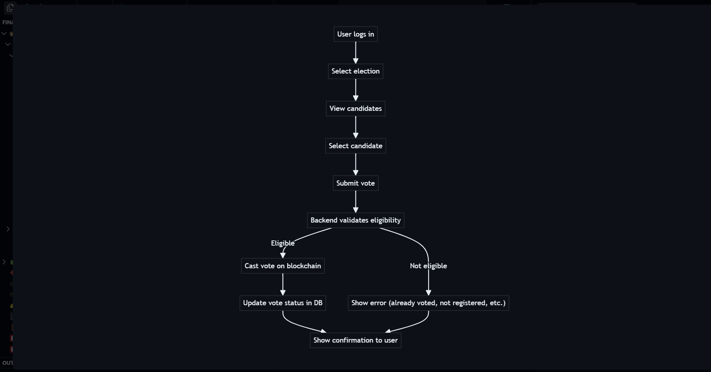
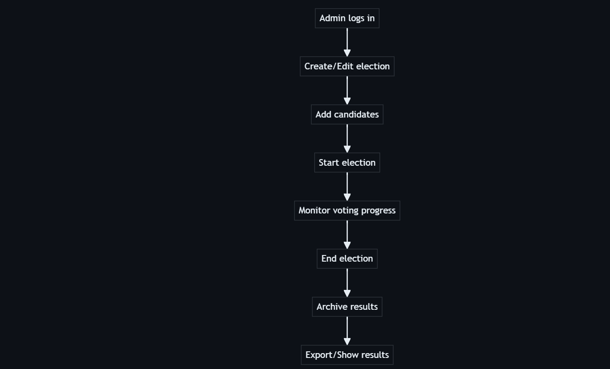

# 🗳️ Votechain - Blockchain E-Voting System

[](https://nodejs.org/)
[](https://soliditylang.org/)
[](https://nextjs.org/)
[](https://www.mongodb.com/)
[](LICENSE)

> A secure, transparent, and tamper-proof blockchain-based voting system designed for college elections with real-time results and comprehensive admin controls.

## 📋 Table of Contents

- [✨ Features](#-features)
- [🏗️ Architecture](#️-architecture)
- [🚀 Quick Start](#-quick-start)
- [📁 Project Structure](#-project-structure)
- [🔧 Installation](#-installation)
- [⚙️ Configuration](#️-configuration)
- [🎯 Usage](#-usage)
- [🧪 Testing](#-testing)
- [🔒 Security Features](#-security-features)
- [📊 API Documentation](#-api-documentation)
- [🤝 Contributing](#-contributing)
- [👥 Contributors](#-contributors)
- [📝 License](#-license)

## ✨ Features

### 🔗 Blockchain & Smart Contracts

- **Secure Voting**: Immutable voting records on Ethereum blockchain
- **5 Predefined Positions**: Vice-president, GS(GYMKHANA), GS(CULTURAL), GS(SPORTS), GS(TECHNICAL)
- **Position-based Voting**: One vote per position per voter
- **Real-time Results**: Live election results with tie handling
- **Admin Controls**: Create/complete elections, update fees, emergency stop, withdraw fees
- **Gas Optimized**: Efficient smart contract design with security best practices

### 🖥️ Backend API

- **RESTful API**: Complete backend for all frontend operations
- **MongoDB Integration**: User, candidate, and event data management
- **Email OTP Authentication**: Secure voter registration and login
- **Blockchain Integration**: Full smart contract interaction via ethers.js
- **File Upload**: Candidate profile pictures and documents
- **Auto-completion**: Scheduler for automatic election completion and archiving
- **BigInt Handling**: Proper serialization for blockchain data

### 🎨 Frontend Web App

- **Web3 Integration**: MetaMask wallet connection
- **Real-time Updates**: Live election results and analytics
- **Responsive Design**: Modern UI for voters and admins
- **Admin Panel**: Complete election management interface
- **Voting Interface**: Intuitive voting experience
- **Registration Flows**: Streamlined voter and candidate registration

## 🏗️ Architecture

```
┌─────────────────────────────────────────────────────────────────────────────────┐
│                           BLOCKCHAIN VOTING SYSTEM                              │
│                              Data Flow Architecture                             │
└─────────────────────────────────────────────────────────────────────────────────┘

                    ┌─────────────────┐
                    │   FRONTEND      │
                    │   (Next.js)     │
                    │                 │
                    │ • React UI      │
                    │ • Web3 Wallet   │
                    │ • Admin Panel   │
                    └─────────┬───────┘
                              │
                              │ HTTP/WebSocket
                              │
                    ┌─────────▼───────┐
                    │    BACKEND      │
                    │   (Node.js)     │
                    │                 │
                    │ • Express API   │
                    │ • MongoDB       │
                    │ • Email OTP     │
                    └─────────┬───────┘
                              │
                              │ Web3/ethers.js
                              │
                    ┌─────────▼───────┐
                    │   BLOCKCHAIN    │
                    │  (Ethereum)     │
                    │                 │
                    │ • Smart Contract│
                    │ • Voting Logic  │
                    │ • Results       │
                    └─────────────────┘
```



## 🔄 End-to-End Sequence


## 🔁 Election Lifecycle


## 🚀 Quick Start

### Prerequisites

- **Node.js** (v18 or higher)
- **MongoDB** (local or cloud)
- **Git**

### 1. Clone the Repository

```bash
git clone https://github.com/Mahesh3355/E_Voting_System.git
cd E_Voting_System
```

### 2. Install Dependencies

```bash
# Install root dependencies
npm install

# Install backend dependencies
cd backend
npm install

# Install frontend dependencies
cd ../final/admin
npm install
```

### 3. Configure Environment

#### Smart Contracts

```bash
cd contracts
cp .env.example .env
# Edit .env with your private key and RPC URL
```

#### Backend

```bash
cd backend
cp .env.example .env
# Edit .env with MongoDB URI, email config, and blockchain settings
```

#### Frontend

```bash
cd final/admin
cp .env.local.example .env.local
# Edit .env.local with API URL
```

### 4. Deploy Smart Contracts

```bash
cd contracts
npx hardhat compile
npx hardhat run scripts/deploy.ts --network localhost
```

### 5. Start the System

```bash
# Start backend (Terminal 1)
cd backend
npm start

# Start frontend (Terminal 2)
cd final/admin
npm run dev

# Start auto-archiving (Terminal 3, optional)
cd backend
node auto-complete-and-archive.js
```

## 📁 Project Structure

```
E_Voting_System/
├── 📁 contracts/                 # Smart contracts and blockchain logic
│   ├── contracts/
│   │   └── VotingSystem.sol     # Main voting smart contract
│   ├── test/                    # Hardhat/Chai tests
│   ├── scripts/                 # Deployment scripts
│   └── hardhat.config.ts        # Hardhat configuration
│
├── 📁 backend/                   # Node.js/Express backend
│   ├── index.js                 # Main Express server
│   ├── blockchain.js            # Blockchain service (ethers.js)
│   ├── auto-complete-and-archive.js  # Election scheduler
│   ├── uploads/                 # File uploads
│   └── README.md                # Backend documentation
│
├── 📁 final/admin/              # Next.js frontend
│   ├── src/
│   │   ├── app/                 # Next.js app directory
│   │   │   ├── admin/           # Admin panel
│   │   │   ├── elections/       # Voting pages
│   │   │   ├── votenow/         # Main voting UI
│   │   │   └── register-*/      # Registration pages
│   │   ├── components/          # React components
│   │   ├── contexts/            # Web3 context
│   │   └── services/            # API services
│   └── README.md                # Frontend documentation
│
├── 📄 package.json              # Root dependencies
├── 📄 hardhat.config.ts         # Hardhat configuration
├── 📄 setup.md                  # Detailed setup guide
├── 📄 data_flow_visual.md       # System architecture diagrams
└── 📄 README.md                 # This file
```

## 🗄️ Data Model


## 🔧 Installation

### Smart Contract Setup

```bash
cd contracts
npm install
npx hardhat compile
npx hardhat test
```

### Backend Setup

```bash
cd backend
npm install
# Configure .env file
npm start
```

### Frontend Setup

```bash
cd final/admin
npm install
# Configure .env.local file
npm run dev
```

## ⚙️ Configuration

### Environment Variables

#### Smart Contracts (.env)

```env
PRIVATE_KEY=your-private-key-here
RPC_URL=http://localhost:8545
# For testnet: https://sepolia.infura.io/v3/YOUR_PROJECT_ID
```

#### Backend (.env)

```env
# MongoDB Connection
MONGODB_URI=mongodb://localhost:27017/voting_system

# Email Configuration (Gmail)
EMAIL_USER=your-email@gmail.com
EMAIL_PASS=your-app-password

# Blockchain Configuration
RPC_URL=http://localhost:8545
PRIVATE_KEY=your-private-key-here
CONTRACT_ADDRESS=deployed-contract-address-here
```

#### Frontend (.env.local)

```env
NEXT_PUBLIC_API_URL=http://localhost:5000
```

## 🎯 Usage



### For Voters

1. **Register**: Visit the registration page and provide your details
2. **Verify Email**: Complete email OTP verification
3. **Connect Wallet**: Connect MetaMask wallet
4. **Vote**: Select your preferred candidate for each position
5. **View Results**: Check real-time election results



### For Admins

1. **Create Election**: Set up new election with dates and positions
2. **Manage Voters**: Approve/reject voter registrations
3. **Manage Candidates**: Review and approve candidate applications
4. **Monitor Results**: View live election analytics
5. **Complete Election**: Finalize and archive election results



### For Candidates

1. **Apply**: Submit application with profile and documents
2. **Wait Approval**: Admin reviews application
3. **Campaign**: Once approved, campaign for votes
4. **Monitor Results**: Track voting progress

## 🧪 Testing

### Smart Contract Tests

```bash
cd contracts
npx hardhat test
```

### Backend API Tests

```bash
cd backend
npm test
```

### Frontend Tests

```bash
cd final/admin
npm test
```

### Manual Testing

```bash
# Test voter registration
curl -X POST http://localhost:5000/api/voter/send-otp \
  -H "Content-Type: application/json" \
  -d '{"fullName":"Test User","registrationNumber":"12345","email":"test@example.com","degree":"B.Tech"}'

# Test blockchain integration
curl -X POST http://localhost:5000/api/blockchain/register-voter \
  -H "Content-Type: application/json" \
  -d '{"email":"test@example.com"}'
```

## 🔒 Security Features

- **Blockchain Immutability**: All votes are permanently recorded on Ethereum
- **SHA256 Hashing**: Data integrity through cryptographic hashing
- **Reentrancy Protection**: Smart contract security against attacks
- **Email OTP**: Secure voter authentication
- **Input Validation**: Comprehensive validation on all inputs
- **Environment Security**: Secure handling of private keys and secrets
- **Rate Limiting**: API protection against abuse

## 📊 API Documentation

### Authentication Endpoints

- `POST /api/voter/send-otp` - Send OTP for voter registration
- `POST /api/voter/verify-otp` - Verify OTP and complete registration
- `POST /api/voter/login` - Voter login

### Blockchain Endpoints

- `POST /api/blockchain/register-voter` - Register voter on blockchain
- `POST /api/blockchain/register-candidate` - Register candidate on blockchain
- `POST /api/blockchain/cast-vote` - Cast vote on blockchain
- `GET /api/blockchain/vote-status` - Check voting status
- `GET /api/blockchain/results` - Get election results

### Admin Endpoints

- `POST /api/admin/create-election` - Create new election
- `POST /api/admin/approve-voter` - Approve voter registration
- `POST /api/admin/approve-candidate` - Approve candidate application
- `POST /api/admin/complete-election` - Complete election

For detailed API documentation, see [backend/README.md](backend/README.md).

## 🤝 Contributing

We welcome contributions! Please follow these steps:

1. **Fork** the repository
2. **Create** a feature branch (`git checkout -b feature/amazing-feature`)
3. **Commit** your changes (`git commit -m 'Add amazing feature'`)
4. **Push** to the branch (`git push origin feature/amazing-feature`)
5. **Open** a Pull Request

### Development Guidelines

- Follow the existing code style
- Add tests for new features
- Update documentation as needed
- Ensure all tests pass before submitting

## 📝 License

This project is licensed under the MIT License - see the [LICENSE](LICENSE) file for details.
### 🤝 How to Contribute

We love your input! We want to make contributing to this project as easy and transparent as possible, whether it's:

- 🐛 Reporting a bug
- 💡 Suggesting a new feature
- 📝 Improving documentation
- 🔧 Submitting a fix

**Want to contribute?** Check out our [Contributing Guide](#-contributing) above!

## 📞 Support

For support and questions:

- 📧 Email: [maheshbirajdar3355@gmail.com]
- 🐛 Issues: [GitHub Issues](https://github.com/Mahesh3355/E_Voting_System/issues)
- 📖 Documentation: [Wiki](https://github.com/Mahesh3355/E_Voting_System/wiki)

> **Note**:Repository is live at [https://github.com/Mahesh3355/E_Voting_System](https://github.com/Mahesh3355/E_Voting_System)

---

<div align="center">
  <p>Made with ❤️ for secure and transparent voting</p>
  <p>⭐Star this repository if you found it helpful!</p>
</div>
